# TerraSight: EuroSAT RGB vs Multispectral Land-Cover Classification

**Author:** Toktam Khatibi, PhD

TerraSight is a research-grade remote-sensing machine-learning framework that investigates the value of Sentinel-2 multispectral imagery for land-use and land-cover classification using the EuroSAT dataset.

The project compares RGB and multispectral deep-learning models, evaluates transfer-learning strategies, performs controlled Sentinel-2 band-ablation studies, and analyzes how spectral information affects classification performance.

Unlike conventional classification benchmarks, TerraSight focuses on a central scientific question:

> Which Sentinel-2 spectral information contributes most effectively to land-cover classification performance?

The framework emphasizes reproducibility, scientific rigor, explainability, reliability, and practical interpretation of multispectral remote-sensing models.

# Project Overview and Architecture

## Figure 1. Graphical Abstract

The graphical abstract summarizes the complete research workflow and the key scientific findings of the project. Starting from the EuroSAT Sentinel-2 dataset, the study compares RGB and multispectral representations using ResNet18-based architectures, investigates the contribution of individual spectral bands through systematic ablation studies, and evaluates model reliability, explainability, and robustness.

The study demonstrates that carefully selected spectral bands can provide complementary information beyond RGB imagery, while increasing the number of spectral bands does not necessarily improve classification performance. The results highlight the importance of informed spectral-band selection and model calibration in Earth Observation applications.

<p align="center">
  
</p>

**Figure 1.** Graphical abstract of the TerraSight project showing dataset inputs, experimental pipelines, evaluation modules, explainability analysis, reliability assessment, and the principal scientific findings.

### Key Messages

- Comparison of RGB and multispectral Sentinel-2 representations.
- Evaluation of pretrained and non-pretrained ResNet18 models.
- Systematic spectral-band ablation experiments.
- Reliability and calibration assessment using confidence-based metrics.
- Explainability analysis using Grad-CAM visualizations.
- Investigation of robustness under input perturbations.
- Identification of the most informative spectral-band combinations.
- End-to-end reproducible machine learning workflow.

## Figure 2. Project Architecture

Figure 2 presents the complete technical architecture of the project. The architecture is organized as a sequence of interconnected layers, beginning with data acquisition and preprocessing, followed by model development, experimental evaluation, explainability analysis, robustness testing, and reproducibility infrastructure.

This architecture was designed to satisfy both engineering and scientific objectives. Beyond achieving strong classification performance, the framework provides mechanisms for understanding model decisions, evaluating prediction confidence, assessing robustness, and ensuring experimental reproducibility.

<p align="center">
  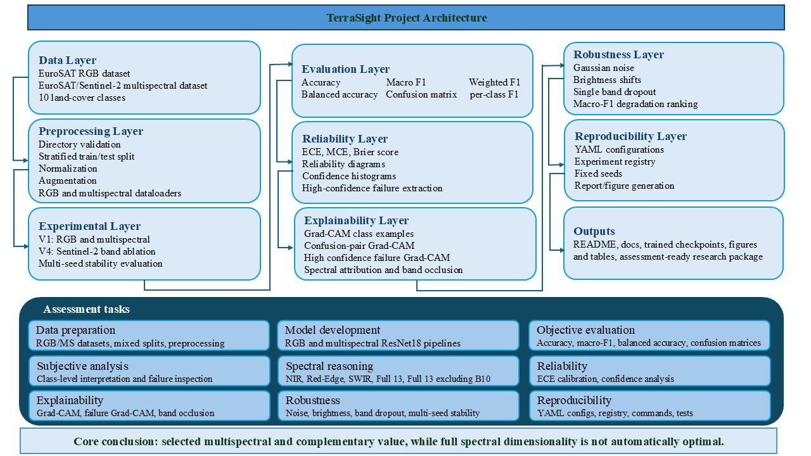
</p>

**Figure 2.** End-to-end architecture of the TerraSight framework showing data processing, model development, experimental evaluation, reliability analysis, explainability modules, robustness assessment, and reproducibility infrastructure.

### Architectural Components

#### Data Layer

- EuroSAT RGB dataset.
- EuroSAT multispectral Sentinel-2 dataset.
- Ten land-cover classes.

#### Preprocessing Layer

- Dataset validation.
- Stratified train/test splitting.
- Data normalization.
- Data augmentation.
- RGB and multispectral dataloaders.

#### Modeling Layer

- RGB ResNet18 (pretrained).
- RGB ResNet18 (trained from scratch).
- Multispectral ResNet18 (trained from scratch).
- Adapted pretrained multispectral ResNet18.

#### Experimental Layer

- RGB versus multispectral comparison.
- Spectral-band ablation studies.
- Multi-seed evaluation for stability analysis.

#### Evaluation Layer

- Accuracy.
- Macro-F1 score.
- Weighted-F1 score.
- Balanced accuracy.
- Confusion matrix analysis.
- Per-class performance assessment.

#### Reliability Layer

- Expected Calibration Error (ECE).
- Confidence histogram analysis.
- Reliability diagrams.
- High-confidence failure analysis.

#### Explainability Layer

- Grad-CAM visualizations.
- Class-specific attention analysis.
- Failure-case interpretation.
- Spectral attribution investigation.

#### Robustness Layer

- Gaussian noise perturbation.
- Brightness variation analysis.
- Band-dropout experiments.
- Performance degradation assessment.

#### Reproducibility Layer

- YAML configuration files.
- Experiment registry.
- Fixed random seeds.
- Automated figure generation.
- Automated reporting pipeline.

### Design Principles

The framework was designed around five core principles:

1. **Performance** — achieve strong land-cover classification accuracy.
2. **Interpretability** — explain model decisions through visual analysis.
3. **Reliability** — quantify prediction confidence and calibration quality.
4. **Robustness** — evaluate behavior under realistic perturbations.
5. **Reproducibility** — ensure experiments can be repeated exactly.

Together, these components form a comprehensive Earth Observation machine-learning framework that extends beyond conventional benchmark classification and emphasizes scientific rigor, transparency, and reproducibility.

## Key Results

| Finding | Result |
|----------|----------|
| Dataset | EuroSAT |
| Classes | 10 |
| Sensor | Sentinel-2 |
| Samples | ~27,000 |
| Best Overall Model | RGB ResNet18 (ImageNet Pretrained) |
| Best Overall Accuracy | **97.46%** |
| Best Multispectral Configuration | RGB + RedEdge + NIR + SWIR |
| Best Multispectral Accuracy | **95.67%** |
| Best Multispectral Macro-F1 | **95.56%** |
| Best Multispectral Calibration (ECE) | **0.0039** |
| Number of Experimental Configurations | 11+ |
| Random Seeds Evaluated | 3 |

### Main Scientific Finding

The results demonstrate that **spectral selection is more important than spectral quantity**.

Using all available Sentinel-2 bands did not produce the strongest multispectral performance. Instead, a carefully selected combination of RGB, RedEdge, NIR, and SWIR bands achieved the best balance of accuracy, calibration quality, and computational efficiency.

These findings suggest that multispectral information provides complementary information beyond RGB imagery, but performance gains depend strongly on selecting the most informative spectral channels rather than simply increasing input dimensionality.

## Research Questions

### Primary Research Question

Does Sentinel-2 multispectral information provide measurable benefits beyond RGB imagery for land-cover classification?

### Secondary Research Questions

1. Which Sentinel-2 spectral bands contribute most effectively to classification performance?
2. Can transfer learning improve multispectral remote-sensing models?
3. Is a carefully selected subset of spectral bands sufficient to match the performance of full multispectral models?
4. How reliable and interpretable are the resulting predictions?

### Hypothesis

Near-Infrared (NIR), RedEdge, and Short-Wave Infrared (SWIR) bands contain vegetation, moisture, and surface-composition information that is unavailable in RGB imagery. Therefore, combining selected multispectral bands with RGB information is expected to improve discrimination between spectrally similar land-cover classes.

## Scientific Contributions

This project makes several practical and scientific contributions:

### 1. RGB vs Multispectral Benchmark

A systematic comparison of RGB and multispectral ResNet18 classifiers using the EuroSAT dataset.

### 2. Transfer Learning for Multispectral Remote Sensing

Evaluation of adapted ImageNet-pretrained models versus training from scratch.

### 3. Sentinel-2 Band Ablation Study

Controlled experiments investigating the contribution of individual spectral groups, including:

- RGB
- RGB + NIR
- RGB + RedEdge + NIR
- RGB + RedEdge + NIR + SWIR
- Physical Surface Bands
- Full 13-Band Sentinel-2 Imagery

### 4. Reliability and Calibration Analysis

Assessment of prediction trustworthiness using calibration metrics and confidence-based evaluation.

### 5. Explainability and Error Analysis

Investigation of model behaviour through Grad-CAM visualizations, confidence analysis, and failure-case inspection.

### 6. Reproducible Research Framework

Experiment tracking, configuration management, reproducible pipelines, and documented workflows suitable for future extension.

## Dataset

### EuroSAT

The project uses the EuroSAT benchmark dataset, a widely adopted remote-sensing dataset derived from Sentinel-2 satellite imagery.

| Property | Value |
|----------|----------|
| Dataset | EuroSAT |
| Number of Classes | 10 |
| Total Images | ~27,000 |
| Spatial Resolution | 64 × 64 pixels |
| Source Sensor | Sentinel-2 |
| Modalities | RGB and Multispectral |

### Land-Cover Classes

The dataset contains the following land-use and land-cover categories:

- AnnualCrop
- Forest
- HerbaceousVegetation
- Highway
- Industrial
- Pasture
- PermanentCrop
- Residential
- River
- SeaLake

### Sentinel-2 Spectral Bands

Experiments utilize combinations of Sentinel-2 spectral bands:

| Spectral Group | Bands |
|----------|----------|
| RGB | B2, B3, B4 |
| RedEdge | B5, B6, B7 |
| Near Infrared (NIR) | B8, B8A |
| Water Vapour | B9 |
| Cirrus | B10 |
| Short-Wave Infrared (SWIR) | B11, B12 |

These bands capture complementary information related to vegetation health, moisture content, atmospheric conditions, and surface composition.

### Dataset Citation

> Helber, P., Bischke, B., Dengel, A., & Borth, D. (2019). EuroSAT: A Novel Dataset and Deep Learning Benchmark for Land Use and Land Cover Classification. *IEEE Journal of Selected Topics in Applied Earth Observations and Remote Sensing*.

## Methodology

### Experimental Design

The project follows a progressive experimental strategy designed to evaluate both predictive performance and spectral utility.

#### Phase 1 — RGB vs Multispectral Comparison

Four baseline models were evaluated:

| Experiment | Description |
|----------|----------|
| RGB Pretrained | ImageNet-pretrained RGB ResNet18 |
| RGB Scratch | RGB ResNet18 trained from scratch |
| Multispectral Adapted | Pretrained ResNet18 adapted for multispectral inputs |
| Multispectral Scratch | Multispectral ResNet18 trained from scratch |

The objective was to determine whether transfer learning and multispectral information improve classification performance.

#### Phase 2 — Sentinel-2 Band Ablation Study

A series of controlled experiments investigated the contribution of different spectral groups:

| Configuration |
|----------|
| RGB |
| RGB + NIR |
| RGB + RedEdge + NIR |
| RGB + RedEdge + NIR + SWIR |
| Physical Surface Bands |
| Full13 Without B10 |
| Full13 |

The objective was to identify the most informative spectral combinations and quantify the value of additional bands.

#### Phase 3 — Reliability and Explainability Analysis

Beyond classification accuracy, the framework evaluates:

- Confidence calibration
- Reliability diagrams
- Expected Calibration Error (ECE)
- Prediction confidence distributions
- Grad-CAM visual explanations
- High-confidence failure cases
- Spectral sensitivity through band-ablation experiments

This enables a more comprehensive assessment of model trustworthiness and practical deployment suitability.

## Repository Structure

```text
terrasight-eurosat-rgb-vs-multispectral/
├── configs/            # Experiment configurations
├── dataset/            # Dataset metadata and preparation
├── docs/               # Extended analyses and documentation
├── experiments/        # Experiment registry and tracking
├── reports/            # Figures, tables, and generated outputs
├── results/            # Model outputs and evaluation results
├── scripts/            # Training and evaluation scripts
├── src/                # Core source code
├── tests/              # Automated tests
└── README.md
````

# Experimental Results

This section presents the empirical evaluation of RGB and multispectral deep-learning models on the EuroSAT benchmark. The experiments investigate three key aspects:

1. The effectiveness of RGB versus multispectral imagery.
2. The impact of transfer learning.
3. The contribution of individual Sentinel-2 spectral groups through controlled band-ablation studies.

## V1: RGB vs Multispectral Comparison

The first experimental phase compares RGB and multispectral ResNet18 models trained using both transfer learning and random initialization.

### Model Comparison

| Model | Accuracy (%) | Macro-F1 (%) | Balanced Accuracy (%) |
|---------|---------:|---------:|---------:|
| RGB ResNet18 (Pretrained) | **97.46** | **97.45** | **97.45** |
| RGB ResNet18 (Scratch) | 95.17 | 95.11 | 95.10 |
| Multispectral ResNet18 (Adapted Pretrained) | 95.46 | 95.37 | 95.36 |
| Multispectral ResNet18 (Scratch) | 93.20 | 92.99 | 93.09 |

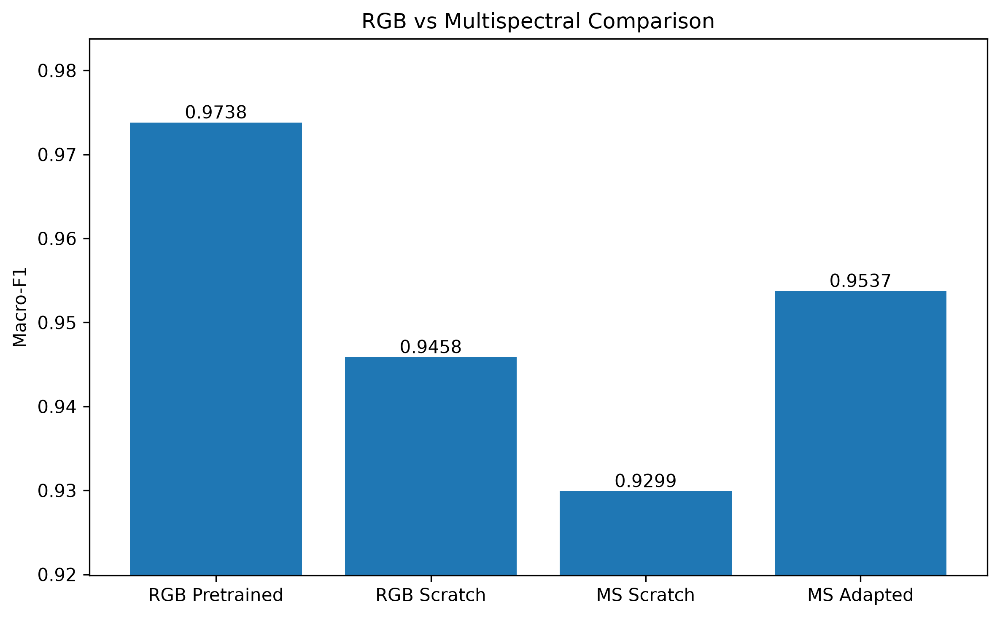

**Figure 1.** Performance comparison between RGB and multispectral baseline models. Transfer learning substantially improves both RGB and multispectral performance.

### Key Findings

- Transfer learning consistently outperformed training from scratch.
- The RGB pretrained model achieved the highest overall classification performance.
- Adapting pretrained RGB weights to multispectral inputs significantly improved multispectral performance.
- Multispectral training from scratch produced the weakest results, highlighting the importance of pretrained initialization.

### Training Dynamics

Representative training and validation curves for the best RGB and multispectral models are shown below.

<table>
<tr>
<td align="center" width="50%">

**RGB (ImageNet-pretrained ResNet18)**

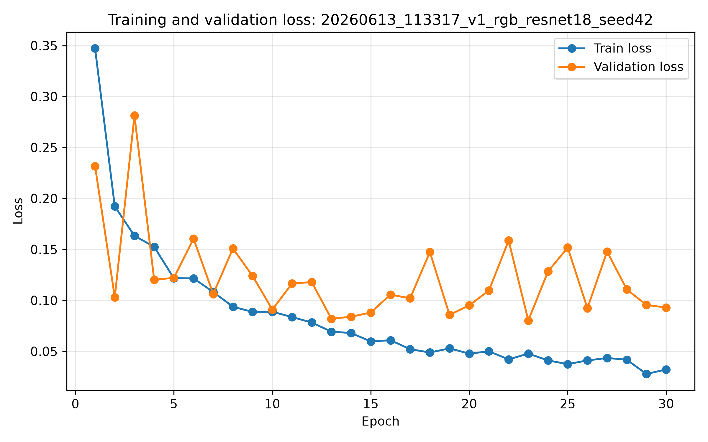

</td>

<td align="center" width="50%">

**Multispectral (Adapted Pretrained ResNet18)**

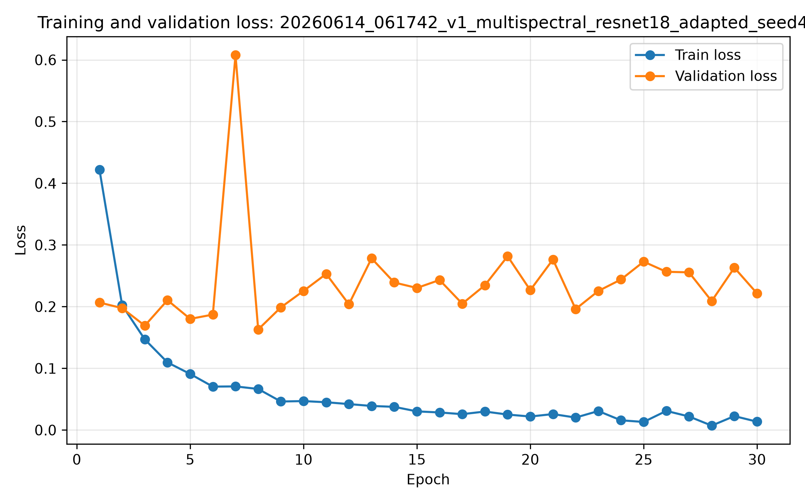

</td>
</tr>
</table>

**Figure 2.** Representative training and validation curves demonstrating stable optimization and convergence behaviour.

## Class-Level Performance Analysis

While overall accuracy is informative, class-level analysis provides deeper insight into the strengths and weaknesses of each model.

### Best RGB Model

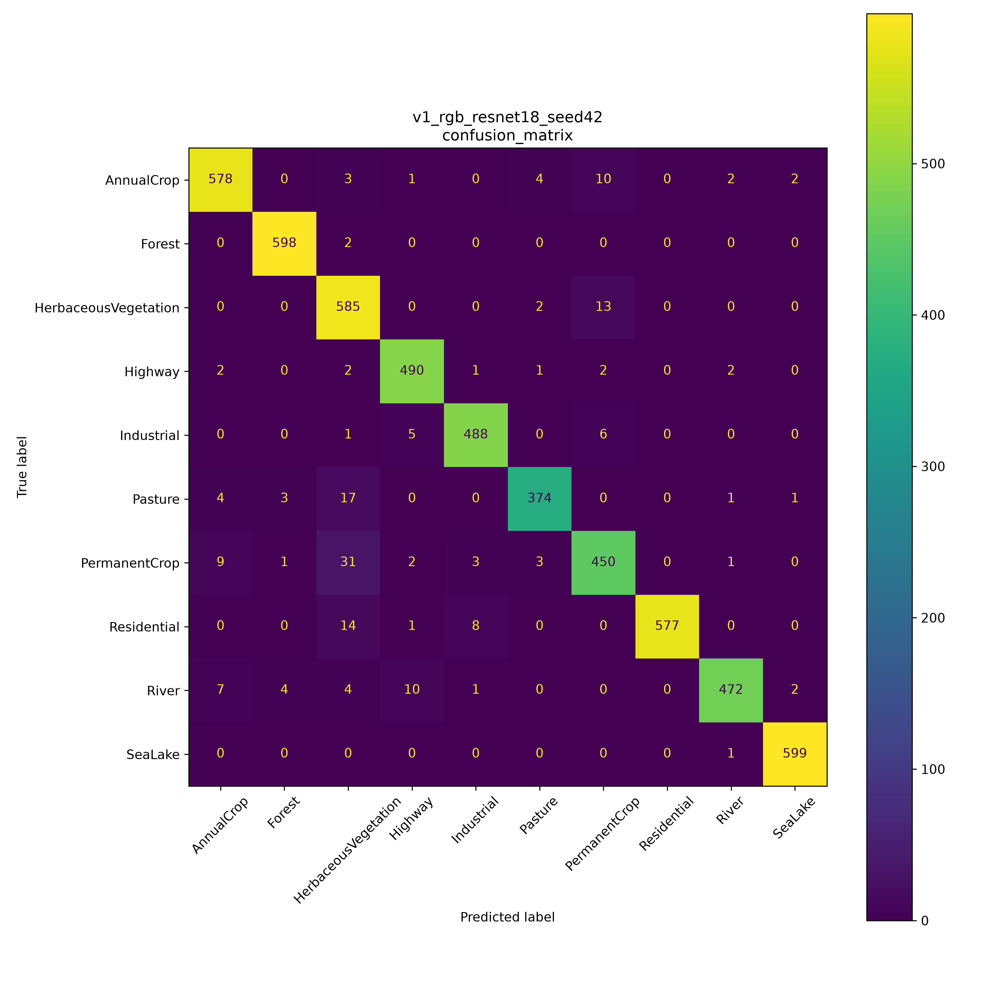

**Figure 3.** Confusion matrix for the best-performing RGB model.

### Best Multispectral Model

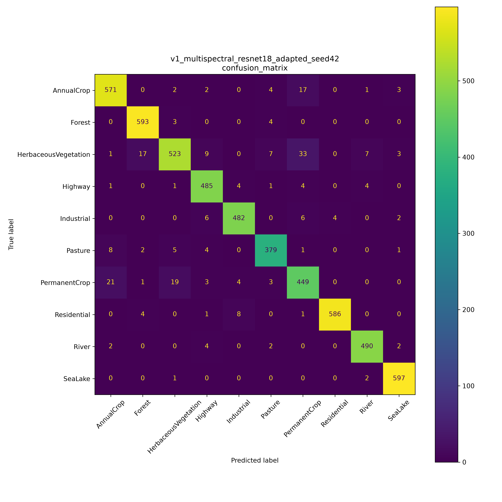

**Figure 4.** Confusion matrix for the best-performing multispectral model.

### Per-Class Performance

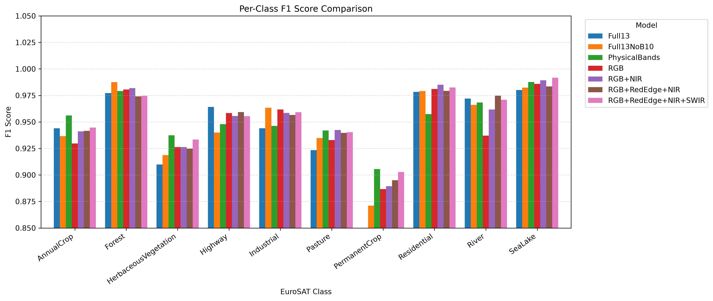

**Figure 5.** Per-class F1-score comparison between RGB and multispectral models.

### Interpretation

Most classes achieve strong classification performance across all models. Remaining errors primarily occur between:

- AnnualCrop and PermanentCrop
- Pasture and HerbaceousVegetation
- River and surrounding vegetation classes

These confusions reflect intrinsic visual and spectral similarities within the EuroSAT taxonomy rather than obvious model failures.

## V4: Sentinel-2 Band Ablation Study

To determine which spectral information contributes most effectively to land-cover classification, a series of controlled band-ablation experiments was performed.

### Evaluated Spectral Configurations

| Configuration | Included Bands |
|----------|----------|
| RGB | B2, B3, B4 |
| RGB + NIR | RGB + B8, B8A |
| RGB + RedEdge + NIR | RGB + B5–B8A |
| RGB + RedEdge + NIR + SWIR | RGB + B5–B12 |
| Physical Surface Bands | Surface-related Sentinel-2 bands |
| Full13 Without B10 | All bands except cirrus band |
| Full13 | All Sentinel-2 bands |

### Ablation Results

| Configuration | Accuracy (%) | Macro-F1 (%) |
|----------|---------:|---------:|
| RGB | 94.94 | 94.86 |
| RGB + NIR | 95.21 | 95.12 |
| RGB + RedEdge + NIR | 95.52 | 95.41 |
| RGB + RedEdge + NIR + SWIR | **95.67** | **95.56** |
| Physical Surface Bands | 94.73 | 94.60 |
| Full13 Without B10 | 95.33 | 95.24 |
| Full13 | 95.47 | 95.38 |

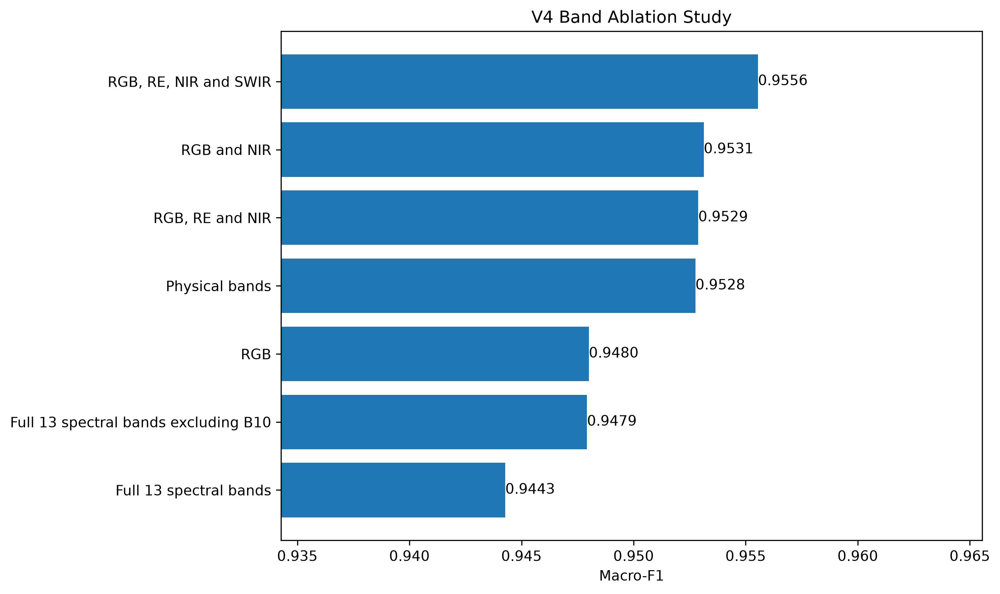

**Figure 6.** Comparison of spectral configurations evaluated during the Sentinel-2 band-ablation study.

### Key Findings

The ablation study reveals several important observations:

1. Adding NIR information improves performance over RGB alone.
2. RedEdge bands provide additional gains for vegetation-related classes.
3. SWIR information further improves discrimination of complex land-cover types.
4. The best-performing configuration is **RGB + RedEdge + NIR + SWIR**.
5. Using all available Sentinel-2 bands does not necessarily produce the best performance.

These findings support the conclusion that **spectral selection is more important than spectral quantity**.

---

## Reliability and Calibration Analysis

Accurate predictions alone are insufficient for practical deployment. Models should also provide reliable confidence estimates.

### Expected Calibration Error (ECE)

| Model | ECE ↓ |
|----------|----------:|
| RGB Pretrained (V1) | 0.0075 |
| RGB Scratch (V1) | 0.0231 |
| Multispectral Adapted (V1) | 0.0269 |
| Multispectral Scratch (V1) | 0.0385 |
| RGB + RedEdge + NIR + SWIR (V4) | **0.0039** |
| Full13 (V4) | 0.0050 |

The results show that transfer learning substantially improves calibration quality. The best-performing multispectral configuration achieved the lowest Expected Calibration Error, indicating excellent agreement between predicted confidence and empirical accuracy.

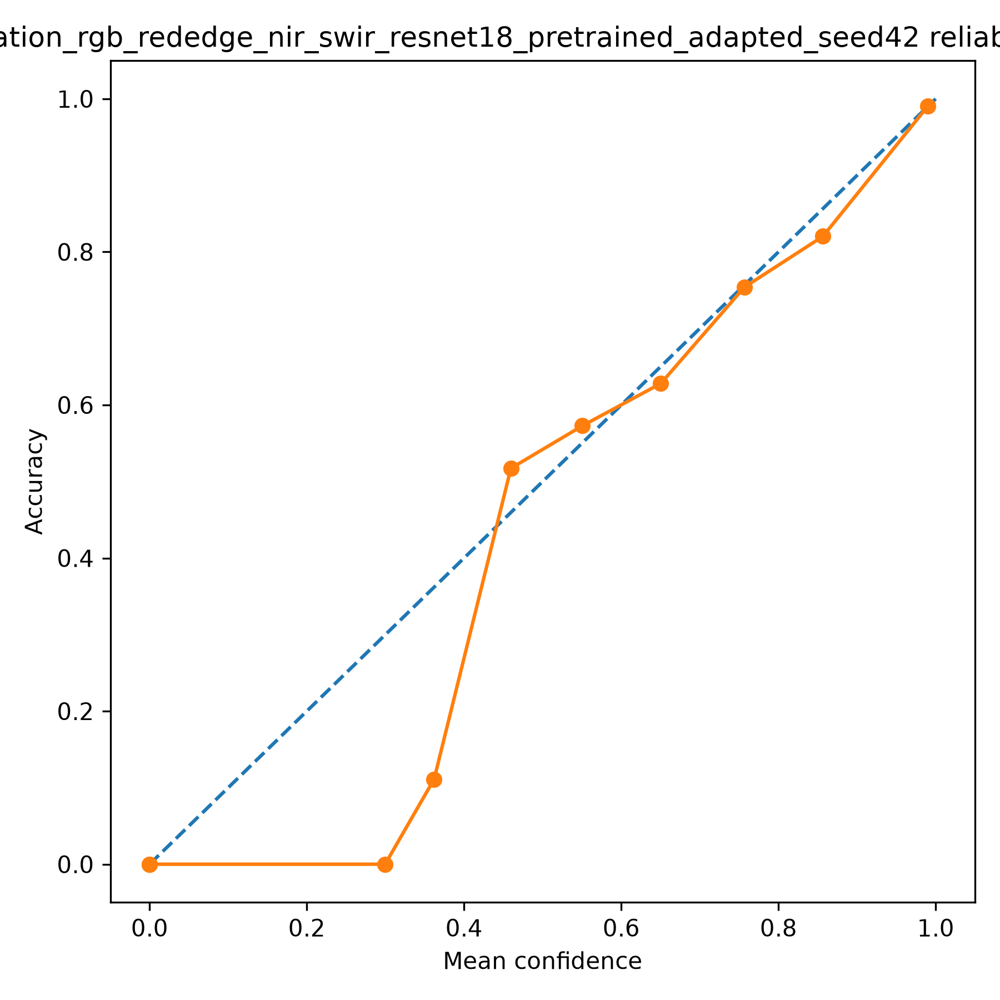

**Figure 7.** Reliability diagram for the best-performing multispectral model. The curve closely follows the ideal calibration line, resulting in very low calibration error.

### Interpretation

The RGB + RedEdge + NIR + SWIR model achieved both:

- Highest multispectral classification performance.
- Best confidence calibration.

This suggests that the model is not only accurate but also trustworthy in terms of confidence estimation.

---

## Prediction Confidence Analysis

To evaluate model certainty, confidence histograms were generated from softmax prediction probabilities.

| RGB Baseline | Multispectral Baseline |
|:---:|:---:|
| 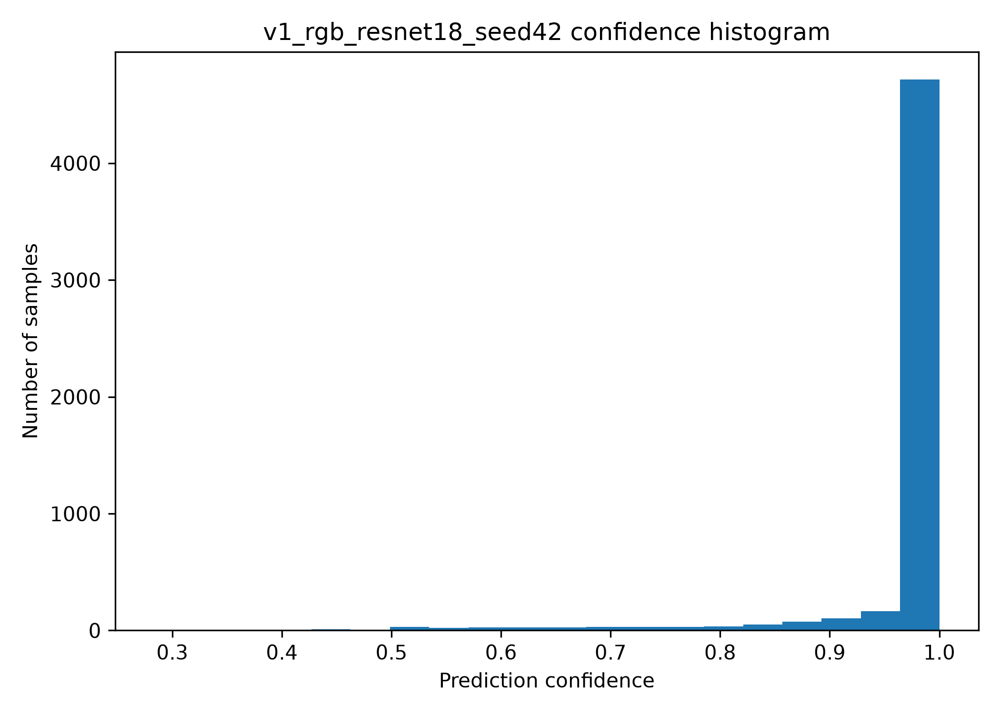 | 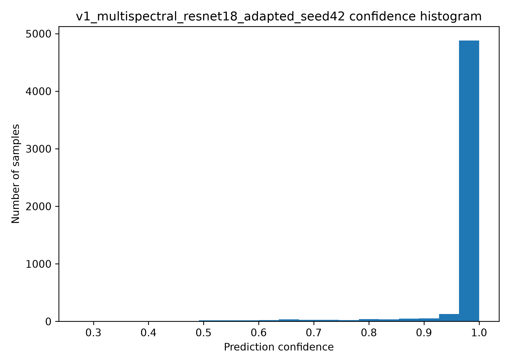 |
| **(a)** RGB Pretrained | **(b)** Multispectral Adapted |

| Full13 | RGB + RedEdge + NIR |
|:---:|:---:|
| 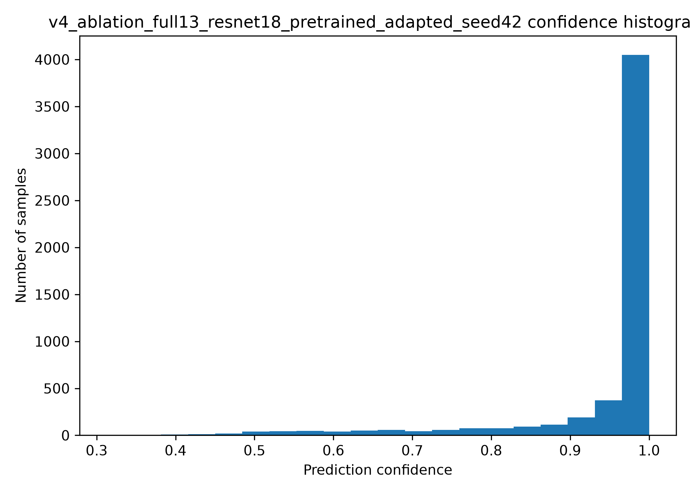 | 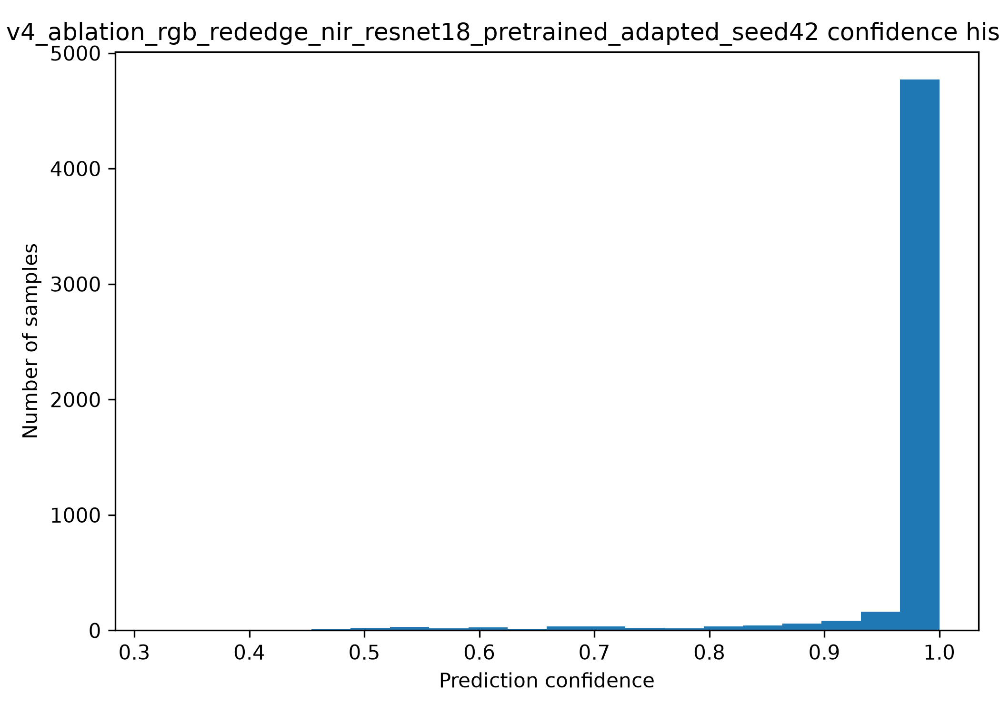 |
| **(c)** Full13 | **(d)** RGB + RedEdge + NIR |

**Figure 8.** Confidence distributions for representative RGB and multispectral models.

### Interpretation

Several consistent patterns emerge:

- Most predictions have confidence values above 0.95.
- Multispectral models exhibit slightly sharper confidence distributions than RGB-only models.
- Reduced-band configurations achieve confidence distributions comparable to Full13 models.
- Carefully selected spectral subsets preserve most discriminative information while reducing input dimensionality.

## Summary of Experimental Findings

The experimental results support four primary conclusions:

1. **Transfer learning is essential** for achieving strong performance in both RGB and multispectral settings.

2. **RGB pretrained models remain extremely competitive**, achieving the highest overall classification accuracy.

3. **Multispectral information provides complementary value**, particularly when combining RGB, RedEdge, NIR, and SWIR bands.

4. **Spectral selection is more important than spectral quantity**, as carefully chosen subsets outperform full-band configurations.

The following sections investigate model reliability, explainability, robustness, and failure modes in greater detail.

````markdown
# Explainability, Robustness, Reproducibility, and Deployment

This section investigates model behaviour beyond classification accuracy, focusing on explainability, robustness, reproducibility, and practical deployment considerations.

---

## Explainability Analysis

Understanding why a model makes a prediction is particularly important in remote-sensing applications where decisions may influence environmental monitoring, land-use assessment, agricultural planning, and policy-making.

To investigate model behaviour, Grad-CAM (Gradient-weighted Class Activation Mapping) was used to visualize the spatial regions that contribute most strongly to model predictions.

### Grad-CAM Analysis

Representative Grad-CAM visualizations are shown below.

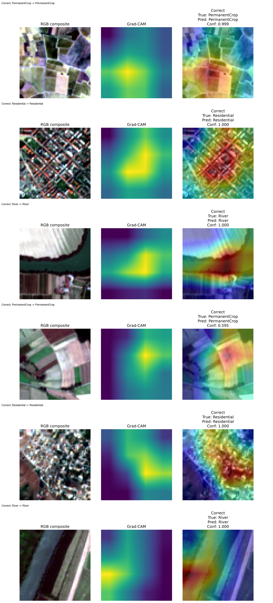

**Figure 9.** Representative Grad-CAM visualizations showing regions that contribute most strongly to model predictions.

### Key Observations

Several consistent patterns emerge:

1. The model typically focuses on semantically meaningful regions rather than background noise.

2. Vegetation-related classes often activate on homogeneous vegetation structures and field patterns.

3. Urban classes activate on dense built-up regions, road networks, and man-made structures.

4. Water-related classes activate primarily on river and lake boundaries.

These observations suggest that the learned representations capture meaningful land-cover characteristics rather than relying on spurious correlations.

### Interpretation

Grad-CAM visualizations indicate that the model frequently attends to regions that are consistent with human interpretation of the scene.

While Grad-CAM does not provide causal explanations, it offers useful qualitative evidence that the classifier relies on semantically relevant image content.

---

## High-Confidence Failure Analysis

Although the best-performing model achieves strong overall performance, understanding its failures provides valuable insight into remaining challenges.


**Figure 10.** Representative high-confidence misclassifications produced by the best-performing multispectral model.

### Key Observations

Most failures occur between semantically similar classes, including:

- AnnualCrop ↔ PermanentCrop
- Pasture ↔ HerbaceousVegetation
- River ↔ Vegetation Classes
- Highway ↔ Industrial

These classes often exhibit similar spatial textures, vegetation patterns, and spectral signatures.

### Interpretation

The failure analysis suggests that:

1. Many remaining errors arise from intrinsic dataset ambiguity.
2. Most misclassifications occur between related land-cover categories.
3. Completely unrelated class confusions are rare.
4. Confidence calibration remains important because some incorrect predictions receive very high confidence scores.

Overall, the failure cases indicate limitations of the dataset taxonomy and class separability rather than catastrophic model behaviour.

---

## Robustness Analysis

Robustness experiments evaluate how model performance changes under controlled perturbations designed to simulate realistic remote-sensing conditions.

The best-performing multispectral model:

```text
RGB + RedEdge + NIR + SWIR
````

was subjected to several perturbation types.

### Noise and Illumination Robustness

| Perturbation        | Accuracy Drop | Macro-F1 Drop |
| ------------------- | ------------: | ------------: |
| Gaussian Noise      |         0.33% |         0.33% |
| Brightness Increase |        -0.04% |        -0.04% |
| Brightness Decrease |         0.31% |         0.32% |

These results demonstrate strong resilience to moderate acquisition noise and illumination variation.

### Spectral Band Sensitivity

| Band Removed     | Macro-F1 Drop |
| ---------------- | ------------: |
| B3 (Green)       |    **59.70%** |
| B2 (Blue)        |        28.63% |
| B4 (Red)         |        18.06% |
| B11 (SWIR)       |         1.09% |
| B8 (NIR)         |         0.85% |
| B12 (SWIR)       |         0.27% |
| B6 (RedEdge)     |         0.27% |
| B5 (RedEdge)     |         0.24% |
| B8A (Narrow NIR) |         0.13% |
| B7 (RedEdge)     |         0.10% |

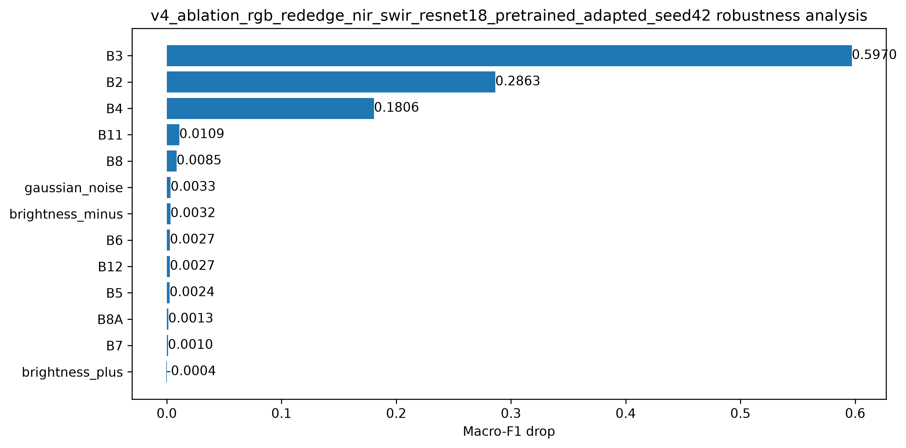

**Figure 11.** Macro-F1 degradation under perturbations and single-band dropout experiments.

### Key Findings

The robustness analysis reveals that:

* RGB channels remain the dominant source of discriminative information.
* NIR and SWIR bands provide measurable complementary value.
* The model is highly robust to moderate noise and illumination changes.
* Spectral selection contributes more strongly to performance than simply increasing the number of bands.

---

## Reproducibility

A major objective of TerraSight is to ensure full experimental reproducibility.

### Experiment Tracking

All experiments are tracked using:

```text
experiments/registry.csv
```

which records:

* Experiment identifiers
* Spectral configurations
* Hyperparameters
* Training settings
* Evaluation metrics
* Output locations

### Configuration Management

Experiments are defined using version-controlled YAML configuration files:

```text
configs/
├── datasets/
├── models/
├── training/
└── experiments/
```

This approach enables exact reproduction of every reported result.

### Multi-Seed Evaluation

To reduce sensitivity to random initialization, experiments were evaluated using multiple random seeds.

Benefits include:

* More reliable performance estimates
* Improved statistical robustness
* Reduced variance due to stochastic training behaviour

---

## Installation

### Clone Repository

```bash
git clone https://github.com/toktamk/Terrasight-Eurosat-RGB-vs-Multispectral.git
cd Terrasight-Eurosat-RGB-vs-Multispectral
```

### Create Environment

```bash
python -m venv .venv && source .venv/bin/activate
```

### Install Dependencies

```bash
pip install -r requirements.txt
```

### Verify Environment

```bash
python scripts/system_info.py
```

Example environment:

```text
PyTorch: 2.12.0+cpu
CUDA Available: False
CUDA Version: None
GPU Count: 0
```

---

## Dataset Preparation

Download the EuroSAT dataset and organize it according to the expected directory structure.

```text
Download the EuroSAT RGB dataset and the corresponding Sentinel-2 multispectral dataset. Extract the datasets and place the class-specific image folders into the appropriate raw-data directories:

data/
├── raw/
│   ├── rgb/
│   │   ├── AnnualCrop/
│   │   ├── Forest/
│   │   ├── HerbaceousVegetation/
│   │   ├── Highway/
│   │   ├── Industrial/
│   │   ├── Pasture/
│   │   ├── PermanentCrop/
│   │   ├── Residential/
│   │   ├── River/
│   │   └── SeaLake/
│   │
│   └── multispectral/
│       ├── AnnualCrop/
│       ├── Forest/
│       ├── HerbaceousVegetation/
│       ├── Highway/
│       ├── Industrial/
│       ├── Pasture/
│       ├── PermanentCrop/
│       ├── Residential/
│       ├── River/
│       └── SeaLake/
```
> **Note:** The repository does not redistribute the EuroSAT dataset. Users must download the dataset from the original source and place it in the directory structure shown above before running any experiments.

Then run:

```bash
python scripts/prepare_dataset.py
```

to generate training, validation, and test splits.

## Training

### RGB Baseline

```bash
python scripts/train.py --config configs/experiments/v1_rgb_pretrained.yaml
```

### Multispectral Baseline

```bash
python scripts/train.py --config configs/experiments/v1_multispectral_adapted.yaml
```

### Band Ablation Experiment

```bash
python scripts/train.py --config configs/experiments/v4_rgb_rededge_nir_swir.yaml
```

## Evaluation

Evaluate a trained model:

```bash
python scripts/evaluate.py --checkpoint path/to/checkpoint.pt
```

Generate figures and reports:

```bash
python scripts/generate_report_figures.py
```

Generate reliability analysis:

```bash
python scripts/reliability_analysis.py
```

Generate Grad-CAM visualizations:

```bash
python scripts/generate_gradcam.py
```

## Limitations

Several limitations should be considered when interpreting the results:

1. Experiments are limited to the EuroSAT dataset.
2. Formal statistical significance testing was not performed.
3. Only ResNet18-based architectures were evaluated.
4. Grad-CAM provides qualitative rather than causal explanations.
5. Results may not directly generalize to other geographic regions or sensors.

## Industrial Relevance

The findings of this project are directly relevant to:

* Earth observation systems
* Environmental monitoring
* Precision agriculture
* Land-use and land-cover mapping
* Climate and sustainability applications
* Remote-sensing decision-support systems

The results suggest that carefully selected multispectral information can improve performance while avoiding unnecessary computational complexity associated with full-band models.

# Discussion, Conclusions, and Additional Resources
## Discussion

This project investigated the value of Sentinel-2 multispectral imagery for land-cover classification using the EuroSAT benchmark dataset.

The results demonstrate that transfer learning remains highly effective in remote-sensing applications and that carefully selected multispectral information can improve classification performance beyond RGB-only inputs.

However, the experiments also reveal that increasing the number of spectral bands does not automatically improve performance. In several cases, reduced-band configurations achieved comparable or superior results relative to full-band models.

This observation suggests that the primary challenge is not maximizing spectral dimensionality but identifying the most informative spectral channels for the target task.

### RGB vs Multispectral Trade-Off

The experimental results highlight an important distinction:

- The **ImageNet-pretrained RGB model** achieved the highest overall classification accuracy.
- The **RGB + RedEdge + NIR + SWIR model** achieved the strongest multispectral performance and best calibration characteristics.

This indicates that RGB imagery already contains substantial discriminative information for EuroSAT classification, while carefully selected multispectral bands provide complementary information that improves robustness, confidence reliability, and performance for challenging land-cover categories.

## Conclusions

The main conclusions of this study are:

### 1. Transfer Learning Is Essential

Across both RGB and multispectral experiments, pretrained models consistently outperformed models trained from scratch.

### 2. RGB Remains a Strong Baseline

The RGB pretrained ResNet18 achieved the highest overall classification performance, demonstrating the effectiveness of transfer learning from large-scale natural image datasets.

### 3. Multispectral Information Provides Complementary Value

Near-Infrared (NIR), RedEdge, and Short-Wave Infrared (SWIR) bands contributed measurable improvements when combined with RGB information.

### 4. Spectral Selection Is More Important Than Spectral Quantity

The best-performing multispectral model used a carefully selected subset of Sentinel-2 bands rather than the complete spectral stack.

### 5. Reliable AI Requires More Than Accuracy

Reliability analysis, calibration assessment, confidence evaluation, explainability methods, and robustness testing provide valuable insights that are not captured by accuracy metrics alone.

## Alignment with Project Objectives

This project addresses all primary objectives of the technical assessment:

| Objective | Status |
|------------|---------|
| RGB vs Multispectral Comparison | ✓ Completed |
| Transfer Learning Evaluation | ✓ Completed |
| Sentinel-2 Band Investigation | ✓ Completed |
| Experimental Reproducibility | ✓ Completed |
| Quantitative Evaluation | ✓ Completed |
| Error Analysis | ✓ Completed |
| Explainability Analysis | ✓ Completed |
| Reliability Assessment | ✓ Completed |
| Robustness Evaluation | ✓ Completed |
| Scientific Interpretation | ✓ Completed |

## Extended Documentation

The repository includes additional analyses and technical documentation beyond the main README.

| Document | Description |
|-----------|-------------|
| `docs/reliability_analysis.md` | Calibration, ECE, reliability diagrams, and confidence analysis |
| `docs/explainability_analysis.md` | Grad-CAM and visual interpretation results |
| `docs/failure_analysis.md` | High-confidence failure investigation |
| `docs/robustness_analysis.md` | Noise, illumination, and band-dropout experiments |
| `docs/experimental_appendix.md` | Supplementary figures, tables, and ablation results |

## Reproducibility Checklist

The repository includes:

- Version-controlled source code
- Configuration-driven experiments
- Experiment registry (`registry.csv`)
- Fixed random seeds
- Automated evaluation scripts
- Figure-generation utilities
- Structured output directories
- Reproducible training pipelines

These components allow all reported experiments to be reproduced from configuration files and recorded experiment metadata.

## Repository Navigation

```text
README.md                         # Project overview
configs/                          # Experiment configurations
src/                              # Core implementation
scripts/                          # Training and evaluation scripts
experiments/registry.csv          # Experiment tracking
results/                          # Model outputs
reports/figures/                  # Generated figures
docs/                             # Extended analyses
````

## Potential Future Work

Several directions could further extend this work:

### Model Development

* Vision Transformers (ViTs)
* ConvNeXt
* Remote-sensing foundation models
* Self-supervised learning

### Data and Modalities

* Multi-temporal Sentinel-2 imagery
* Sentinel-1 SAR integration
* Cross-dataset evaluation
* Domain adaptation

### Reliability and Explainability

* Temperature scaling
* Conformal prediction
* Spectral attribution methods
* Class-specific band importance analysis

### Operational Deployment

* Efficient inference pipelines
* Model compression
* Edge deployment
* Real-time monitoring systems

## Citation

If you use this repository, please cite:

```bibtex
@misc{khatibi2026terrasight,
  title={TerraSight: EuroSAT RGB vs Multispectral Land-Cover Classification},
  author={Toktam Khatibi},
  year={2026},
  url={https://github.com/toktamk/Terrasight-Eurosat-RGB-vs-Multispectral}
}
```

## Contact

**Toktam Khatibi, PhD**

GitHub: https://github.com/toktamk/Terrasight-Eurosat-RGB-vs-Multispectral

For questions, suggestions, or collaboration opportunities, please open an issue in the repository.

## Acknowledgements

This work builds upon:

* EuroSAT Dataset
* Sentinel-2 Mission (European Space Agency)
* PyTorch
* Torchvision
* Open-source remote-sensing research community

**TerraSight demonstrates that understanding spectral information can be as important as improving classification accuracy. By combining reproducible experimentation, band-ablation studies, reliability analysis, and explainability methods, the project provides a systematic investigation of how Sentinel-2 spectral information contributes to land-cover classification performance.**


## Future Work

Potential extensions include:

* Self-supervised multispectral pretraining
* Vision Transformers and foundation models
* Temporal Sentinel-2 analysis
* Cross-dataset evaluation
* Hierarchical land-cover classification
* Advanced calibration techniques
* Multi-modal fusion with SAR imagery

## Citation

If you use this work, please cite:

```bibtex
@misc{khatibi2026terrasight,
  title={TerraSight: EuroSAT RGB vs Multispectral Land-Cover Classification},
  author={Toktam Khatibi},
  year={2026},
  url={https://github.com/toktamk/Terrasight-Eurosat-RGB-vs-Multispectral}
}
```

## Acknowledgements

* EuroSAT Dataset
* Sentinel-2 Mission (European Space Agency)
* PyTorch
* Torchvision
* Open-source remote-sensing community

